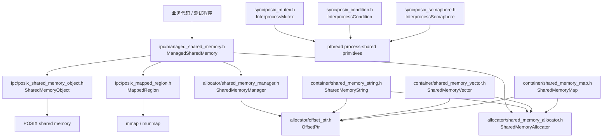
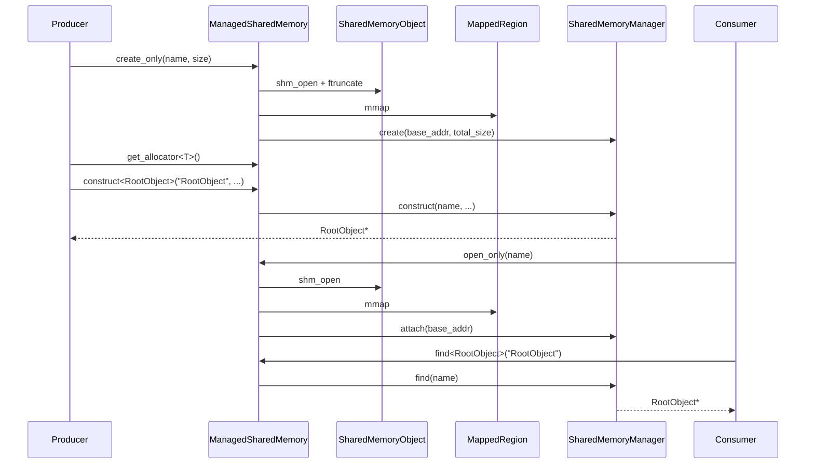
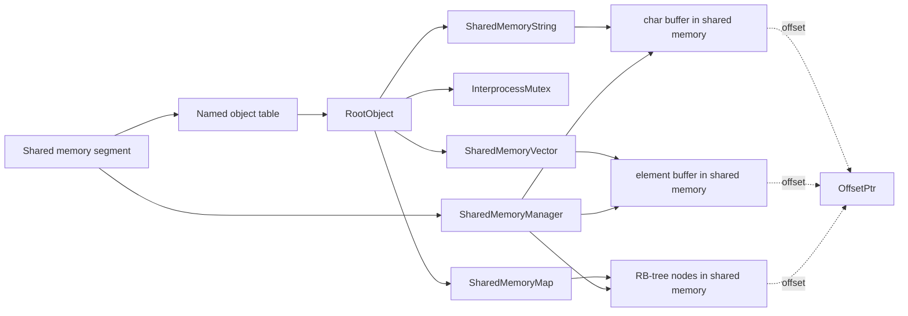
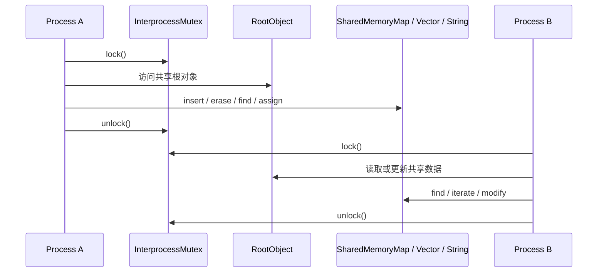

# shm_next

`interprocess/` 提供了一套基于 POSIX shared memory 的轻量级跨进程数据共享组件。它的目标不是完整复刻 Boost.Interprocess，而是在当前工程中提供一组可直接使用的共享内存对象管理、分配器、容器和同步原语。

## 目录结构

### `allocator/`

这一层负责共享内存内存模型本身。

- `offset_ptr.h`
  - 定义 `OffsetPtr<T>`，使用“相对偏移”而不是绝对地址保存指针。
  - 这是跨进程访问的关键，因为不同进程映射同一段共享内存时，虚拟地址通常不同。
- `shared_memory_allocator.h`
  - 定义 `SharedMemoryAllocator<T>`。
  - 它把容器的元素分配转发给 `SharedMemoryManager`，让对象真正落在共享内存里。
- `shared_memory_manager.h`
  - 定义 `SharedMemoryManager`。
  - 它位于共享内存段开头，协调内部 block allocator 和 named object registry，负责分配/释放内存，以及按名字构造、查找和销毁对象。
- `detail/`
  - 放置 allocator 内部实现，包括 block allocator 和 named object registry。

### `container/`

这一层提供建立在共享内存分配器之上的容器。

- `shared_memory_string.h`
  - 提供 `BasicSharedMemoryString` / `SharedMemoryString`。
  - 适合在共享内存中保存字符串，并支持跨进程访问。
- `shared_memory_vector.h`
  - 提供 `SharedMemoryVector<T>`。
  - 接口风格接近 `std::vector`，内部使用共享内存 allocator。
- `shared_memory_map.h`
  - 提供 `SharedMemoryMap<Key, T, Compare>`。
  - 接口风格接近 `std::map`，内部使用 `container/detail/` 下的红黑树实现保存键值对，支持有序遍历、查找、插入、删除等操作。

### `ipc/`

这一层负责 POSIX 共享内存对象和映射生命周期。

- `posix_shared_memory_object.h`
  - 对 `shm_open`、`ftruncate`、`shm_unlink` 做了 RAII 封装。
- `posix_mapped_region.h`
  - 对 `mmap` / `munmap` 做了 RAII 封装。
- `managed_shared_memory.h`
  - 当前项目最常用的入口。
  - 它把共享内存对象、映射区域、`SharedMemoryManager` 组合起来，提供：
    - 创建或打开共享内存段
    - 获取 `SharedMemoryAllocator<T>`
    - `construct<T>(name, ...)`
    - `find<T>(name)`
    - `destroy<T>(name)`
    - 查询剩余内存

### `sync/`

这一层提供跨进程同步原语。

- `posix_mutex.h`
  - `InterprocessMutex`
  - 基于 `pthread_mutex_t`，使用 `PTHREAD_PROCESS_SHARED`，可在多个进程间共享。
  - 在支持 `PTHREAD_MUTEX_ROBUST` 的平台上会启用 robust mutex，并在 owner-dead 后自动 mark consistent，避免其他进程永久阻塞。
- `posix_condition.h`
  - `InterprocessCondition`
  - 基于 `pthread_cond_t`，可与 `InterprocessMutex` 配合使用。
- `posix_semaphore.h`
  - `InterprocessSemaphore`
  - 使用 mutex + condition 实现计数信号量。

### `interprocess.cpp`

静态库锚点文件。它通过包含公共头文件，保证这些头文件被库目标统一导出，并作为 `shm_next_interprocess` 静态库的编译单元存在。

## 核心设计

## 流程图

### 1. 模块关系图

下面这张图描述了 `interprocess/` 内各层之间的依赖关系：



### 2. 共享内存创建与访问流程

下面这张图对应最典型的 producer / consumer 用法：



### 3. 共享对象内部的数据流

下面这张图描述共享内存中对象和容器的典型关系：



### 4. 带锁访问共享容器的建议流程

当前容器本身不持锁，推荐由调用方在共享根对象上持有一个 `InterprocessMutex`：



### 1. 为什么使用 `OffsetPtr`

共享内存中的普通裸指针在不同进程里通常不可直接复用，因为映射基地址可能不同。  
`OffsetPtr<T>` 保存的是“当前对象地址到目标对象地址的偏移量”，因此同一块共享内存被多个进程映射后，仍然可以正确解析指向的对象。

### 2. 为什么容器要使用自定义 allocator

如果容器内部仍使用普通堆内存分配，那么只有容器对象本身在共享内存里，内部元素仍在进程私有地址空间中，跨进程访问就会失效。  
`SharedMemoryAllocator<T>` 保证容器节点、字符串缓冲区、vector 元素等都由共享内存管理器分配。

### 3. 同步策略

当前容器本身不内建锁。  
`SharedMemoryString`、`SharedMemoryVector`、`SharedMemoryMap` 都默认由调用方负责同步，通常做法是在共享根对象里放一个 `InterprocessMutex`，访问共享数据前显式加锁。

## 典型使用方式

最常见的入口是 `ManagedSharedMemory`：

```cpp
#include "interprocess/ipc/managed_shared_memory.h"
#include "interprocess/container/shared_memory_string.h"

using namespace interprocess;

struct RootObject
{
    SharedMemoryString message;

    explicit RootObject(const SharedMemoryAllocator<char>& alloc)
        : message(alloc)
    {
    }
};

int main()
{
    ManagedSharedMemory segment(create_only, "demo_segment", 64 * 1024);
    RootObject* root =
        segment.construct<RootObject>("RootObject", segment.get_allocator<char>());

    root->message = "hello shared memory";
}
```

在 consumer 进程中：

```cpp
ManagedSharedMemory segment(open_only, "demo_segment");
RootObject* root = segment.find<RootObject>("RootObject");
```

对象不再需要时可以显式销毁：

```cpp
segment.destroy<RootObject>("RootObject");
```

## 当前已覆盖的能力

- 命名对象构造、查找与销毁
- 共享内存字符串
- 共享内存向量
- 共享内存有序 map
- 跨进程 mutex / condition / semaphore
- producer / consumer 风格示例测试

## 测试文件参考

`test/` 目录下已经有一组示例程序，可以作为使用参考：

- `shm_string_producer.cpp` / `shm_string_consumer.cpp`
- `shm_vector_producer.cpp` / `shm_vector_consumer.cpp`
- `shm_nested_producer.cpp` / `shm_nested_consumer.cpp`
- `shm_map_producer.cpp` / `shm_map_consumer.cpp`
- `shm_open_or_create.cpp`
- `shm_semaphore.cpp`
- `shm_mutex_robust.cpp`
- `shm_manager_lifecycle.cpp`

其中：

- `string` 示例展示最基础的命名对象共享
- `vector` 示例展示共享容器和显式加锁
- `nested` 示例展示容器嵌套容器
- `map` 示例展示有序键值存储和较复杂的业务结构
- `open_or_create` 示例验证首次创建会初始化段，再次打开会复用已有对象

## 使用约束与注意事项

- 放进共享内存容器的对象，内部成员也必须是共享内存友好的类型。
  - 例如 `SharedMemoryString`、`SharedMemoryVector`、`SharedMemoryMap`
  - 或纯 POD / 标量类型
- 不要在共享对象内部保存普通裸指针、`std::string`、`std::vector` 等进程私有内存对象。
- 多进程并发读写共享对象时，必须由调用方保证同步。
- `open_or_create` 已区分首次创建和打开已有段；极端崩溃恢复场景仍建议由业务层做清理或重建策略。

可通过 CTest 运行已注册的独立用例：

```sh
ctest --test-dir build --output-on-failure
```

## 安装与 CMake 集成

项目支持 CMake install/export：

```sh
cmake --install build --prefix /your/install/prefix
```

下游项目可使用导出目标：

```cmake
find_package(shm_next REQUIRED CONFIG)
target_link_libraries(your_target PRIVATE shm_next::interprocess)
```

## 一句话总结

如果你只想记住一条：  
`ManagedSharedMemory` 负责“打开共享内存”，`SharedMemoryAllocator` 负责“把对象真的放进去”，`OffsetPtr` 负责“让不同进程都能正确找到这些对象”，而 `container/` 下的容器负责“像普通 STL 一样使用这些共享数据”。
