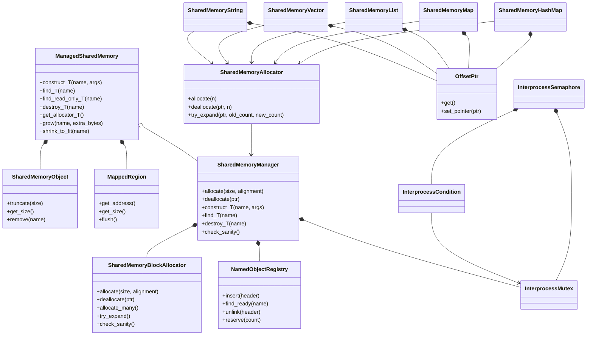
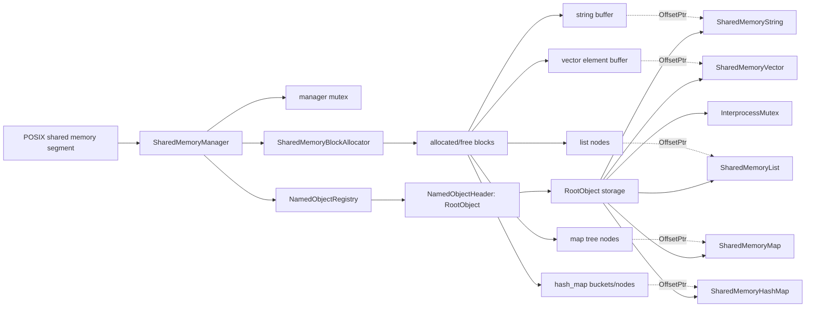
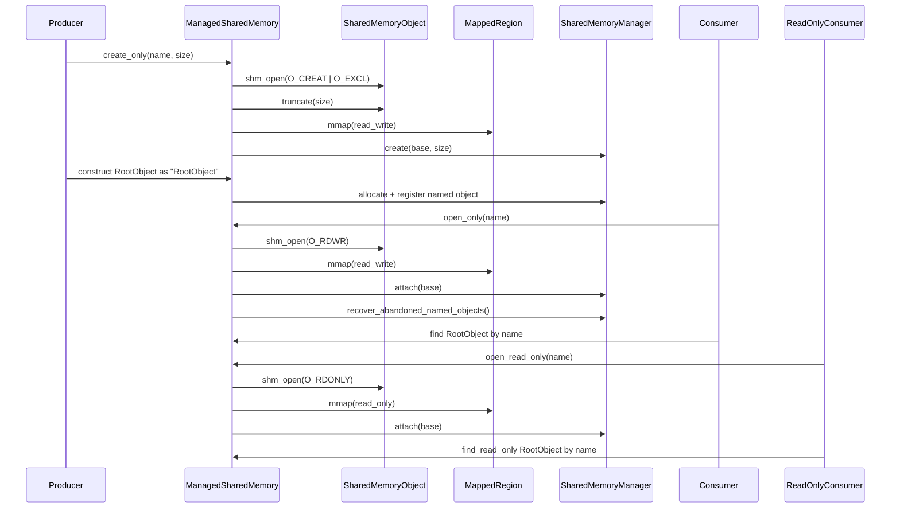
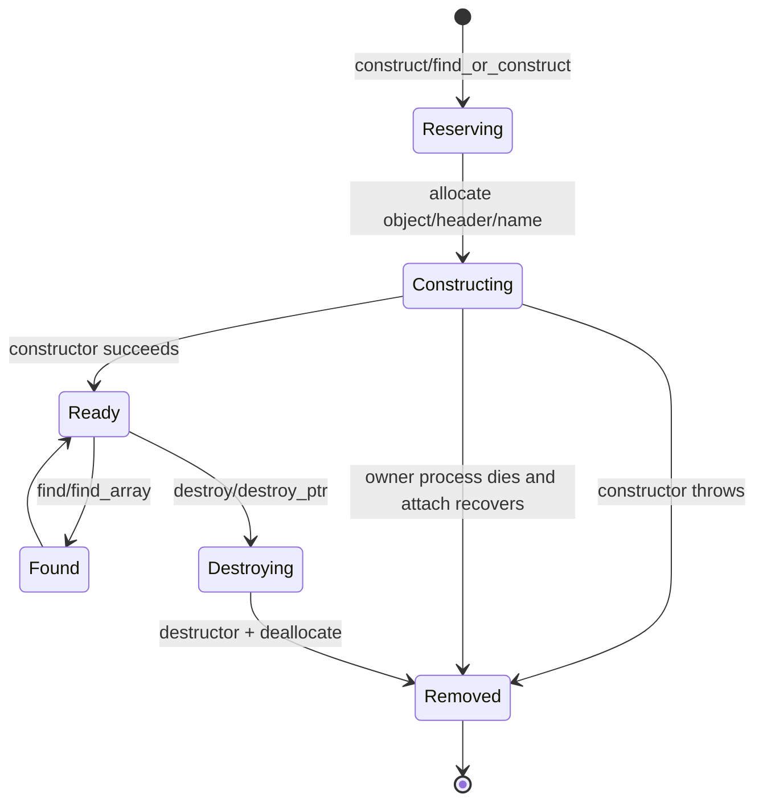
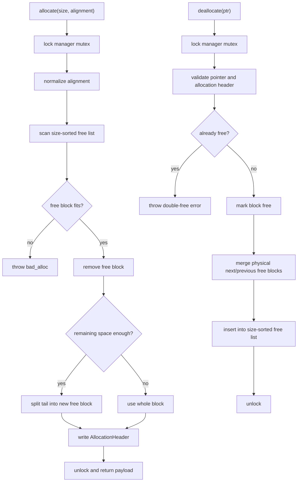
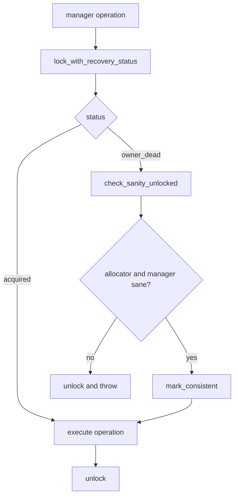
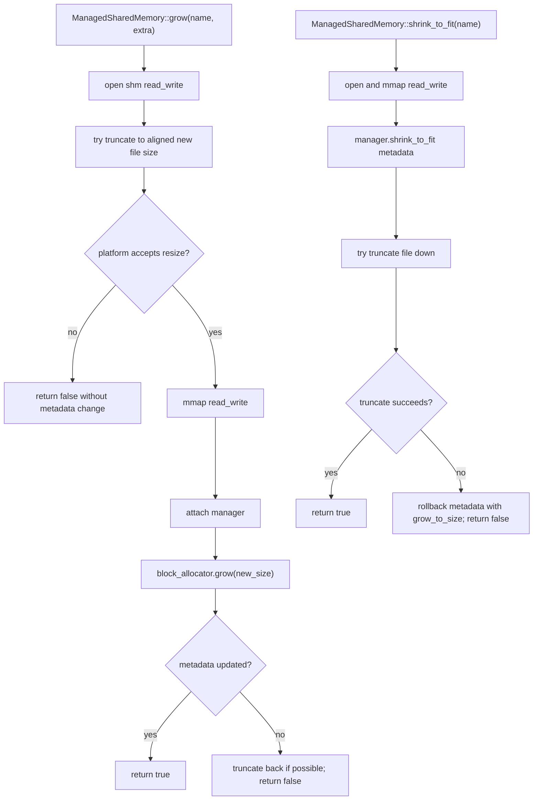

# shm_next

`shm_next` 是一个不依赖 Boost 的轻量级 POSIX shared memory 组件集。它参考了 Boost.Interprocess 的核心模型，但只保留当前工程需要的能力：共享内存段管理、段内分配器、命名对象、共享内存友好容器和跨进程同步原语。

当前实现适合用来在多个进程之间共享 C++ 对象、字符串、顺序容器、链表、哈希表、有序 map 和自定义根对象。容器本身不内建业务锁，调用方需要用共享内存中的 `InterprocessMutex` 或其他同步原语保护并发读写。

新读者建议先看 [shm_next 设计文档](docs/design_for_beginners.md)，它按学习路线、模块分层、内存布局、对象生命周期、allocator、只读快照和测试入口系统解释工程设计。

性能对比文档：

- [优化后性能总览](docs/performance_optimization_summary.md)
- [Vector 性能对比](docs/vector_performance_comparison.md)
- [Map 性能对比](docs/map_performance_comparison.md)
- [HashMap 性能对比](docs/hash_map_performance_comparison.md)
- [List 性能对比](docs/list_performance_comparison.md)

## 核心能力

- POSIX shared memory RAII 封装：`shm_open`、`ftruncate`、`mmap`、`munmap`、`shm_unlink`。
- 管理型共享内存入口：`ManagedSharedMemory` 支持 `create_only`、`open_only`、`open_or_create`、`open_read_only`。
- 统一错误体系：`InterprocessError` + `InterprocessErrc`，核心 attach/layout/allocator/只读违规路径可按稳定错误码处理；robust mutex owner-dead 使用 `InterprocessErrc::owner_dead`。
- 诊断快照：`SharedMemoryAllocatorStats` 同时提供 allocator 扫描型统计和段内累计计数（allocate/deallocate/失败/split/merge/try_expand）。
- 段内分配器：`SharedMemoryManager` + `SharedMemoryAllocator<T>`。
- 命名对象：`construct`、`find`、`find_or_construct`、数组构造、`destroy`、`destroy_ptr`。
- 共享内存容器：`SharedMemoryString`、`SharedMemoryVector<T>`、`SharedMemoryList<T>`、`SharedMemoryMap<K,V>`、`SharedMemoryHashMap<K,V>`。
- 跨进程同步：mutex、shared mutex、condition、semaphore，mutex 在支持的平台启用 robust owner-dead 语义。
- 同步包装器：`with_lock`、`LockedRef<T, Mutex>`、`Synchronized<T, Mutex>`，用于 RAII 加锁和批量访问。
- 稳健性检查：allocator sanity、double-free 检测、非法指针检测、初始化状态机、崩溃构造清理。
- 性能辅助：`allocate_many`、`deallocate_many`、`try_expand`、vector/string 原地扩容、map node cache。
- CTest 覆盖：按模块分类的容器接口、多进程加锁、嵌套容器、allocator、IPC、同步原语、benchmark、性能对比和 producer/consumer 集成场景。

## 目录结构

```text
interprocess/
  error.h
  diagnostics.h
  allocator/
    offset_ptr.h
    shared_memory_allocator.h
    shared_memory_manager.h
    detail/
      named_object_registry.h
      shared_memory_block_allocator.h
  container/
    shared_memory_string.h
    shared_memory_vector.h
    shared_memory_list.h
    shared_memory_map.h
    shared_memory_hash_map.h
    detail/shared_memory_hash_table.h
    detail/shared_memory_rbtree_map.h
  ipc/
    managed_shared_memory.h
    posix_mapped_region.h
    posix_shared_memory_object.h
  sync/
    posix_mutex.h
    posix_shared_mutex.h
    posix_condition.h
    posix_semaphore.h
    synchronized.h
test/
  CMakeLists.txt
  container/
    string/
      shm_string_test.cpp
      shm_string_producer.cpp
      shm_string_consumer.cpp
      shm_string_benchmark.cpp
    vector/
      shm_vector_test.cpp
      shm_vector_producer.cpp
      shm_vector_consumer.cpp
      shm_vector_benchmark.cpp
    list/
      shm_list_test.cpp
      shm_list_producer.cpp
      shm_list_consumer.cpp
      shm_list_benchmark.cpp
    map/
      shm_map_test.cpp
      shm_map_producer.cpp
      shm_map_consumer.cpp
      shm_map_benchmark.cpp
    hash_map/
      shm_hash_map_test.cpp
      shm_hash_map_producer.cpp
      shm_hash_map_consumer.cpp
      shm_hash_map_benchmark.cpp
    nested/
      nested_*_test.cpp
      shm_concurrent_process_stress_test.cpp
    compare/
      shm_benchmark.cpp
      shm_vector_perf_compare.cpp
      shm_map_perf_compare.cpp
      shm_list_perf_compare.cpp
  allocator/
    shm_*_test.cpp
  ipc/
    shm_*_test.cpp
  sync/
    shm_*_test.cpp
```

## 类图与流程图

### 核心类关系



### 共享内存段内布局



### 创建、打开与只读快照流程



### 命名对象生命周期



### 段内分配与释放流程



### Robust Mutex 恢复流程



### 静态 Grow / Shrink 流程



## 主要模块

### `OffsetPtr<T>`

共享内存里的普通裸指针不能安全跨进程复用，因为不同进程映射同一段共享内存时，虚拟地址通常不同。

`OffsetPtr<T>` 保存的是“指针对象自身地址到目标对象地址的相对偏移”。只要对象之间的相对位置不变，不同进程即使映射基址不同，也能重新计算出正确地址。

当前 `OffsetPtr` 已限制 const 转换方向，提供基础 pointer traits / rebind，并把 null sentinel 冲突和不可表示偏移从 debug 断言提升为运行时异常。

### `SharedMemoryManager`

`SharedMemoryManager` 放在共享内存段开头，负责：

- 初始化状态管理：`uninitialized`、`initializing`、`initialized`、`corrupted`。
- 段内内存分配和释放。
- 命名对象注册、查找、销毁。
- allocator sanity 检查和内存统计。
- abandoned constructing object 清理。
- segment grow/shrink 的元数据更新。

所有修改元数据的路径都通过 manager 内部 mutex 串行化。mutex owner-dead 后会先做 sanity check，再决定是否恢复。

### `SharedMemoryBlockAllocator`

段内 allocator 使用 block header 管理空闲块，空闲链表按大小排序，偏向 best-fit 行为。它支持：

- 对齐分配。
- 分裂和合并空闲块。
- `allocate_many` / `deallocate_many`。
- `try_expand`，让 vector/string 在相邻空间可用时原地扩容。
- `check_sanity`、`all_memory_deallocated`、`zero_free_memory`。
- 静态 segment grow/shrink 时扩展或裁剪尾部空闲块。

当前实现仍是轻量版本，不是 Boost 的完整 `rbtree_best_fit`。如果需要更强的规模化分配性能，下一步可以引入边界标签、末尾哨兵和树形空闲索引。

### 命名对象 registry

命名对象 registry 保存名字、对象地址、实例数量、对象大小、类型指纹、状态和 owner pid。

已支持：

- 动态长度名称，不再截断固定长度。
- hash bucket 加速查询。
- `find_or_construct`。
- `find<T>` / `find_array<T>` / `find_or_construct<T>` / `destroy<T>` / `destroy_ptr<T>` 的类型校验。
- 数组构造和失败回滚。
- `destroy_ptr`。
- attach 时清理已死亡进程留下的 constructing/destroying 条目。
- `reserve_named_objects` / `shrink_to_fit_indexes` 的接口。

注意：当前 reserve/shrink 主要是接口和统计语义，底层 bucket 仍是固定数量；它不是 Boost 那种真正预分配索引节点的实现。

### `ManagedSharedMemory`

`ManagedSharedMemory` 是最常用入口，组合了 `SharedMemoryObject`、`MappedRegion` 和 `SharedMemoryManager`。

支持的打开方式：

```cpp
ManagedSharedMemory segment(create_only, "demo", 64 * 1024);
ManagedSharedMemory segment(open_only, "demo");
ManagedSharedMemory segment(open_or_create, "demo", 64 * 1024);
ManagedSharedMemory segment(open_read_only, "demo");
```

只读映射只能使用只读 API，例如：

```cpp
ManagedSharedMemory snapshot(open_read_only, "demo");
const RootObject* root = snapshot.find_read_only<RootObject>("RootObject");
```

在只读映射上调用 `construct`、`find`、`destroy`、`get_allocator`、可写 manager accessor 会抛出异常，避免误写只读 mmap。

### 同步原语

`InterprocessMutex` 基于 `pthread_mutex_t`，使用 `PTHREAD_PROCESS_SHARED`。

已支持：

- `lock` / `try_lock` / `unlock`。
- `try_lock_for` / `try_lock_until` / `timed_lock`。
- `lock_with_recovery_status` / `try_lock_with_recovery_status`。
- Linux robust mutex owner-dead 检测和 `mark_consistent`。

`InterprocessCondition` 基于 `pthread_cond_t`，`InterprocessSemaphore` 基于 mutex + condition 实现。

## 基本用法

### Producer

```cpp
#include "interprocess/container/shared_memory_string.h"
#include "interprocess/ipc/managed_shared_memory.h"
#include "interprocess/sync/posix_mutex.h"
#include "interprocess/sync/synchronized.h"

using namespace interprocess;

using SynchronizedString = Synchronized<SharedMemoryString, InterprocessMutex>;

struct RootObject
{
    SynchronizedString message;

    explicit RootObject(const SharedMemoryAllocator<char>& char_allocator)
        : message(char_allocator)
    {
    }
};

int main()
{
    ManagedSharedMemory::remove("demo_segment");

    ManagedSharedMemory segment(create_only, "demo_segment", 64 * 1024);
    RootObject* root =
        segment.construct<RootObject>("RootObject", segment.get_allocator<char>());

    root->message.with_lock([](SharedMemoryString& message) {
        message = "hello shared memory";
    });
}
```

### Consumer

```cpp
#include "interprocess/container/shared_memory_string.h"
#include "interprocess/ipc/managed_shared_memory.h"
#include "interprocess/sync/posix_mutex.h"
#include "interprocess/sync/synchronized.h"

using namespace interprocess;

using SynchronizedString = Synchronized<SharedMemoryString, InterprocessMutex>;

struct RootObject
{
    SynchronizedString message;
};

int main()
{
    ManagedSharedMemory segment(open_only, "demo_segment");
    RootObject* root = segment.find<RootObject>("RootObject");

    root->message.with_lock([](const SharedMemoryString& message) {
        const char* text = message.c_str();
        (void)text;
    });
}
```

### 只读快照

```cpp
ManagedSharedMemory snapshot(open_read_only, "demo_segment");
const RootObject* root = snapshot.find_read_only<RootObject>("RootObject");
```

只读模式不会锁 manager mutex，因为锁本身会写入共享内存。manager 会通过 metadata generation 检测只读 attach 和只读查询过程中是否遇到并发元数据修改；如果检测到不稳定，会重试或抛出异常。它仍然不替代业务对象内容的并发同步。

## 对象生命周期

创建单个对象：

```cpp
auto* value = segment.construct<int>("Answer", 42);
```

查找或创建：

```cpp
auto* value = segment.find_or_construct<int>("Answer", 42);
```

创建数组：

```cpp
int* values = segment.construct_array<int>("Values", 4, 7);
std::size_t count = 0;
int* found = segment.find_array<int>("Values", &count);
```

销毁：

```cpp
segment.destroy<int>("Answer");
segment.destroy_array<int>("Values");
segment.destroy_ptr(value);
```

当前实现会记录实例数量、对象大小和类型指纹。`find<T>`、`find_array<T>`、`find_or_construct<T>`、`destroy<T>`、`destroy_ptr<T>` 使用的 `T` 和创建类型不一致时会抛出异常，并保持原对象不被错误销毁。

## Segment Grow / Shrink

接口：

```cpp
bool grew = ManagedSharedMemory::grow("demo_segment", 64 * 1024);
bool shrunk = ManagedSharedMemory::shrink_to_fit("demo_segment");
```

语义：

- 这是静态维护操作，不应与其他正在访问同一段共享内存的进程并发执行。
- 成功时会更新共享内存对象大小和 manager 元数据。
- 如果平台不支持对 POSIX shm 做二次 `ftruncate`，函数会返回 `false`，并保持现有对象和 allocator 元数据一致。

macOS 上常见限制是 POSIX shm 创建后无法可靠二次调整大小，测试已覆盖失败不破坏状态的路径。

## 测试

构建：

```sh
cmake -S . -B build -DCMAKE_BUILD_TYPE=Release
cmake --build build -j 8
```

`CMAKE_BUILD_TYPE` 支持 `Release` 和 `Debug`，未指定时默认为 `Release`。

运行全部 CTest：

```sh
ctest --test-dir build --output-on-failure
```

当前测试目录与 CMake 组织方式：

```text
顶层 CMakeLists.txt
  ├── add_subdirectory(interprocess)
  └── add_subdirectory(test)

interprocess/CMakeLists.txt
  └── 负责 shm_next::interprocess 静态库与头文件导出

test/CMakeLists.txt
  ├── 递归收集 test/**/*.cpp
  ├── 用相对路径生成唯一 target 名
  ├── 注册功能 / nested / allocator / ipc / sync / benchmark / compare 测试
  └── 注册 producer/consumer 集成测试
```

当前 CTest 分类覆盖：

- `test/container/string|vector|list|map|hash_map/`
  - `shm_<container>_test.cpp`：接口功能 + 多进程加锁读写
  - `shm_<container>_producer.cpp` / `shm_<container>_consumer.cpp`
  - `shm_<container>_benchmark.cpp`：常用接口大量读写与耗时统计
- `test/container/nested/`
  - 两两嵌套功能测试，覆盖 `vector/list/map/hash_map` 双向组合
  - `string` 仅作为内层元素参与嵌套
  - 额外包含矩阵测试和跨进程冲突压力测试
- `test/container/compare/`
  - `shm_vector_perf_compare.cpp`
  - `shm_map_perf_compare.cpp`
  - `shm_list_perf_compare.cpp`
  - `shm_benchmark.cpp`
- `test/allocator/`
  - allocator 基础、碎片化、manager 生命周期、offset_ptr、diagnostics stats
- `test/ipc/`
  - open/create、layout version、统一错误体系、只读快照、崩溃恢复、shared memory object、mapped region
- `test/sync/`
  - mutex、shared mutex、condition、semaphore

只运行某类测试：

```sh
ctest --test-dir build -L container --output-on-failure
ctest --test-dir build -L nested --output-on-failure
ctest --test-dir build -L allocator --output-on-failure
ctest --test-dir build -L ipc --output-on-failure
ctest --test-dir build -L sync --output-on-failure
ctest --test-dir build -L benchmark --output-on-failure
ctest --test-dir build -L compare --output-on-failure
ctest --test-dir build -L p0 --output-on-failure
```

只运行 producer/consumer 集成场景：

```sh
ctest --test-dir build -L producer --output-on-failure
```

producer/consumer 集成场景覆盖：

- `string_producer_consumer`：字符串 root object 的生产和消费。
- `vector_producer_consumer`：带业务锁的 vector 持续生产和消费。
- `list_producer_consumer`：链表跨进程生产、消费和顺序校验。
- `map_producer_consumer`：map 插入、更新、删除、区间查询和迭代顺序。
- `hash_map_producer_consumer`：hash map 插入、覆盖、遍历和查找校验。

这些用例由 `cmake/run_producer_consumer_pair.sh` 组织。需要交互回车的 producer 会通过 FIFO 自动结束，长时间运行的 producer 会在输出 ready 日志后启动 consumer。

运行单个 benchmark / compare 可执行程序示例：

```sh
./build/test_container_string_shm_string_benchmark
./build/test_container_vector_shm_vector_benchmark
./build/test_container_compare_shm_benchmark
./build/test_container_compare_shm_vector_perf_compare
```

这些程序会输出容器常用接口或跨组件对比的耗时指标，用于趋势观察和回归对比，不作为严格稳定性能基准。


## Large data manual stress

`shm_next` 提供一个手动大数据验证工具，用于验证 1GiB / 10GiB 级共享内存段的创建、raw allocator 大块 payload 分配、分块写入、跨进程读取、checksum 校验、sanity 检查和资源释放。该工具会编译为普通测试可执行文件，但默认不注册进 CTest，避免日常测试或 CI 自动占用大量空间。

推荐先跑 1GiB，确认平台允许 POSIX shm 大映射后再跑 10GiB：

```sh
cmake --build build -j4
./build/test/test_ipc_shm_large_data_stress_test --size 1G --chunk 64M --readers 2
./build/test/test_ipc_shm_large_data_stress_test --size 10G --chunk 128M --readers 2
```

工具默认失败也会尽力 `ManagedSharedMemory::remove(name)` 释放 shm 名称；只有显式传入 `--keep-on-failure` 时才保留现场。运行前后会输出 `df -h` 和 `/dev/shm`（如存在）信息，便于确认空间释放。

如需手动注册到 CTest，可配置：

```sh
cmake -S . -B build-large -DSHM_NEXT_REGISTER_LARGE_STRESS_TESTS=ON
ctest --test-dir build-large -L "manual|large|stress" --output-on-failure
```

注意：macOS/Linux 的 POSIX shm 后端、可用磁盘、地址空间和系统策略都可能影响 10GiB 映射是否成功。该工具优先验证 raw allocator 大块 payload，不使用 `SharedMemoryVector<uint8_t>` 存 10GiB，避免逐元素构造带来的额外成本。

## 使用约束

- 放进共享内存的对象不能持有进程私有资源指针。
- 容器成员应使用共享内存友好类型，例如 `SharedMemoryString`、`SharedMemoryVector`、`SharedMemoryList`、`SharedMemoryMap`、`SharedMemoryHashMap`。
- 不要把 `std::string`、`std::vector`、普通裸指针直接作为跨进程共享对象成员，除非它们只保存进程本地临时状态。
- 容器不自带业务锁。多进程并发读写必须由调用方同步。
- `open_read_only` 会检测 manager 元数据是否稳定；业务对象内容如果仍有 writer 并发修改，需要额外同步协议。
- `destroy<T>` 必须使用和构造时一致的类型，否则会抛出类型不匹配异常。
- POSIX shared memory 名称在不同平台有长度和字符限制，测试里使用短名称避免 macOS `ENAMETOOLONG`。
- `ManagedSharedMemory::remove(name)` 只 unlink 名称；已经映射的进程仍可继续访问到它们释放映射为止。

## 与 Boost.Interprocess 的关系

本项目参考了 Boost.Interprocess 的以下思路：

- managed segment 作为共享内存入口。
- offset pointer 支持不同进程不同映射基址。
- 段内 allocator + shared-memory-aware STL-like containers。
- named object registry。
- manager 内部元数据加锁。
- robust synchronization 和 sanity 检查。
- grow/shrink 作为静态维护操作。

本项目刻意不引入 Boost 依赖，也没有完整复刻 Boost 的所有能力。当前仍可继续增强的方向包括：

- 跨编译器、跨版本更稳定的命名对象类型标识策略。
- 更完整的 `OffsetPtr` 标准库互操作能力。
- 更细粒度的只读快照协议，覆盖业务对象内容版本。
- 真正的 `atomic_func` 多对象原子发布。
- allocator 边界标签、末尾哨兵和树形空闲索引。
- 真正预分配资源的 named object index reserve。

## 安装与 CMake 集成

安装：

```sh
cmake --install build --prefix /your/install/prefix
```

下游项目：

```cmake
find_package(shm_next REQUIRED CONFIG)
target_link_libraries(your_target PRIVATE shm_next::interprocess)
```

## 当前定位

`shm_next` 的定位是工程内可控、可测试、低依赖的共享内存基础设施。它已经覆盖常见跨进程共享对象场景，并通过 CTest 持续验证核心稳健性；对于更复杂的事务、一致性快照和大规模分配策略，后续可以继续按 Boost.Interprocess 的成熟设计逐步补齐。
