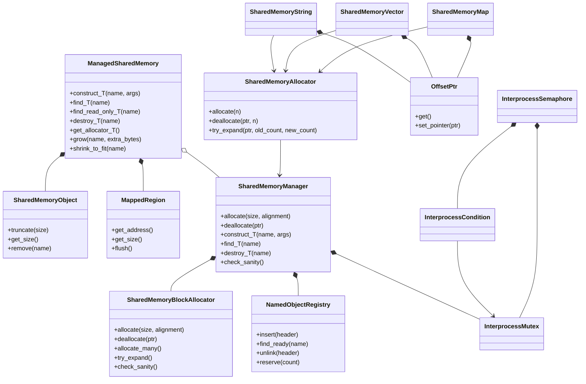
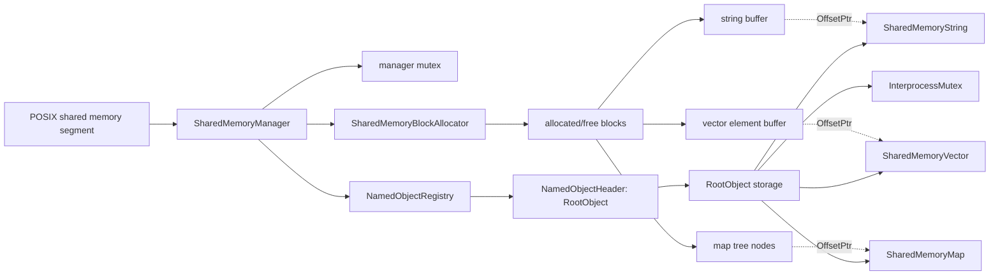
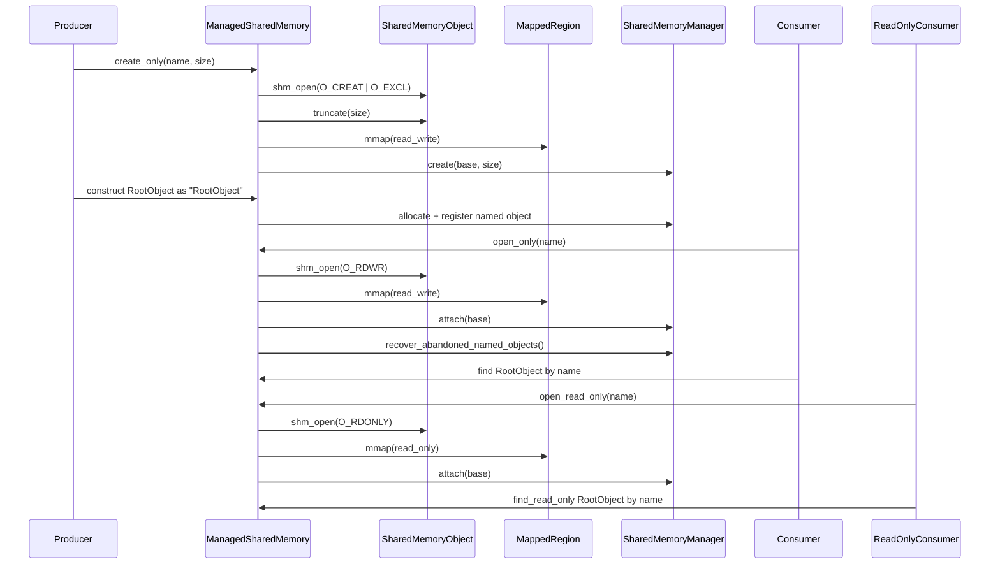
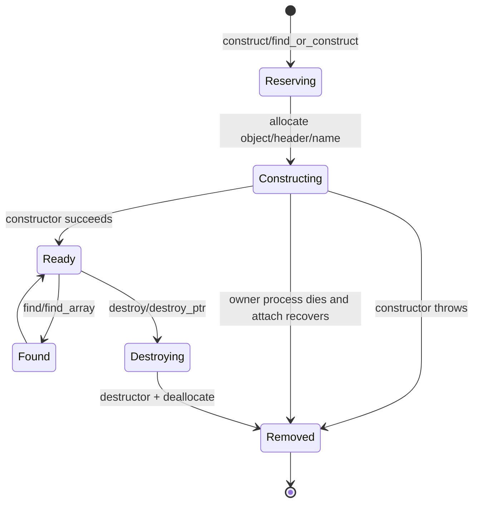
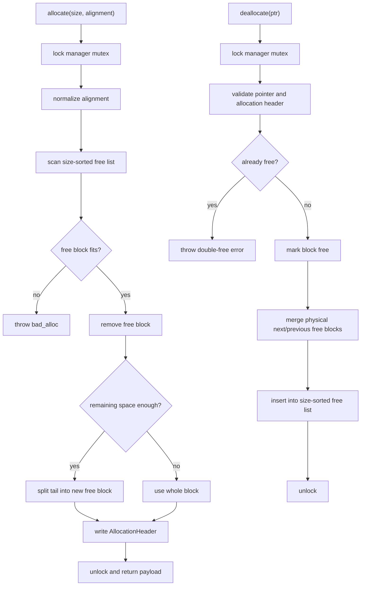
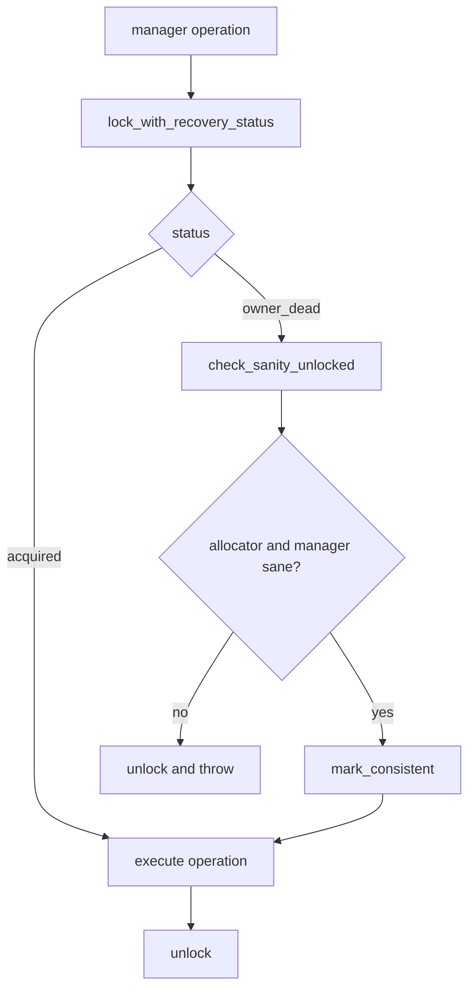
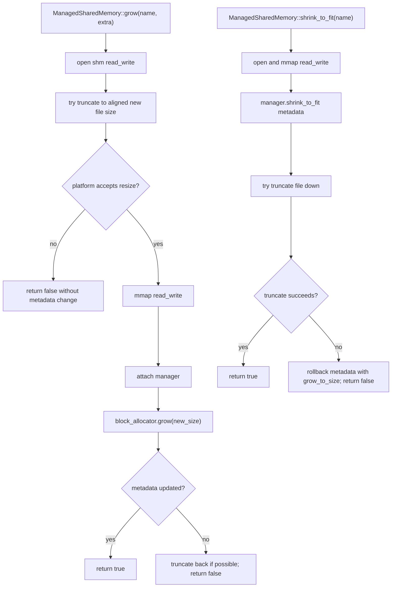

# shm_next

`shm_next` 是一个不依赖 Boost 的轻量级 POSIX shared memory 组件集。它参考了 Boost.Interprocess 的核心模型，但只保留当前工程需要的能力：共享内存段管理、段内分配器、命名对象、共享内存友好容器和跨进程同步原语。

当前实现适合用来在多个进程之间共享 C++ 对象、字符串、顺序容器、有序 map 和自定义根对象。容器本身不内建业务锁，调用方需要用共享内存中的 `InterprocessMutex` 或其他同步原语保护并发读写。

新读者建议先看 [shm_next 设计文档](docs/design_for_beginners.md)，它按学习路线、模块分层、内存布局、对象生命周期、allocator、只读快照和测试入口系统解释工程设计。

## 核心能力

- POSIX shared memory RAII 封装：`shm_open`、`ftruncate`、`mmap`、`munmap`、`shm_unlink`。
- 管理型共享内存入口：`ManagedSharedMemory` 支持 `create_only`、`open_only`、`open_or_create`、`open_read_only`。
- 段内分配器：`SharedMemoryManager` + `SharedMemoryAllocator<T>`。
- 命名对象：`construct`、`find`、`find_or_construct`、数组构造、`destroy`、`destroy_ptr`。
- 共享内存容器：`SharedMemoryString`、`SharedMemoryVector<T>`、`SharedMemoryMap<K,V>`。
- 跨进程同步：mutex、condition、semaphore，mutex 在支持的平台启用 robust owner-dead 语义。
- 稳健性检查：allocator sanity、double-free 检测、非法指针检测、初始化状态机、崩溃构造清理。
- 性能辅助：`allocate_many`、`deallocate_many`、`try_expand`、vector/string 原地扩容、map node cache。
- CTest 覆盖：基础同步、生命周期、崩溃恢复、只读快照、多进程并发和 allocator 碎片场景。

## 目录结构

```text
interprocess/
  allocator/
    offset_ptr.h
    shared_memory_allocator.h
    shared_memory_manager.h
    detail/
      named_object_registry.h
      shared_memory_block_allocator.h
  container/
    shared_memory_string.h
    shared_memory_vector.h
    shared_memory_map.h
    detail/shared_memory_rbtree_map.h
  ipc/
    managed_shared_memory.h
    posix_mapped_region.h
    posix_shared_memory_object.h
  sync/
    posix_mutex.h
    posix_condition.h
    posix_semaphore.h
test/
  shm_* test and sample programs
```

## 类图与流程图

### 核心类关系



### 共享内存段内布局



### 创建、打开与只读快照流程



### 命名对象生命周期



### 段内分配与释放流程



### Robust Mutex 恢复流程



### 静态 Grow / Shrink 流程



## 主要模块

### `OffsetPtr<T>`

共享内存里的普通裸指针不能安全跨进程复用，因为不同进程映射同一段共享内存时，虚拟地址通常不同。

`OffsetPtr<T>` 保存的是“指针对象自身地址到目标对象地址的相对偏移”。只要对象之间的相对位置不变，不同进程即使映射基址不同，也能重新计算出正确地址。

当前 `OffsetPtr` 已限制 const 转换方向，提供基础 pointer traits / rebind，并把 null sentinel 冲突和不可表示偏移从 debug 断言提升为运行时异常。

### `SharedMemoryManager`

`SharedMemoryManager` 放在共享内存段开头，负责：

- 初始化状态管理：`uninitialized`、`initializing`、`initialized`、`corrupted`。
- 段内内存分配和释放。
- 命名对象注册、查找、销毁。
- allocator sanity 检查和内存统计。
- abandoned constructing object 清理。
- segment grow/shrink 的元数据更新。

所有修改元数据的路径都通过 manager 内部 mutex 串行化。mutex owner-dead 后会先做 sanity check，再决定是否恢复。

### `SharedMemoryBlockAllocator`

段内 allocator 使用 block header 管理空闲块，空闲链表按大小排序，偏向 best-fit 行为。它支持：

- 对齐分配。
- 分裂和合并空闲块。
- `allocate_many` / `deallocate_many`。
- `try_expand`，让 vector/string 在相邻空间可用时原地扩容。
- `check_sanity`、`all_memory_deallocated`、`zero_free_memory`。
- 静态 segment grow/shrink 时扩展或裁剪尾部空闲块。

当前实现仍是轻量版本，不是 Boost 的完整 `rbtree_best_fit`。如果需要更强的规模化分配性能，下一步可以引入边界标签、末尾哨兵和树形空闲索引。

### 命名对象 registry

命名对象 registry 保存名字、对象地址、实例数量、对象大小、类型指纹、状态和 owner pid。

已支持：

- 动态长度名称，不再截断固定长度。
- hash bucket 加速查询。
- `find_or_construct`。
- `find<T>` / `find_array<T>` / `find_or_construct<T>` / `destroy<T>` / `destroy_ptr<T>` 的类型校验。
- 数组构造和失败回滚。
- `destroy_ptr`。
- attach 时清理已死亡进程留下的 constructing/destroying 条目。
- `reserve_named_objects` / `shrink_to_fit_indexes` 的接口。

注意：当前 reserve/shrink 主要是接口和统计语义，底层 bucket 仍是固定数量；它不是 Boost 那种真正预分配索引节点的实现。

### `ManagedSharedMemory`

`ManagedSharedMemory` 是最常用入口，组合了 `SharedMemoryObject`、`MappedRegion` 和 `SharedMemoryManager`。

支持的打开方式：

```cpp
ManagedSharedMemory segment(create_only, "demo", 64 * 1024);
ManagedSharedMemory segment(open_only, "demo");
ManagedSharedMemory segment(open_or_create, "demo", 64 * 1024);
ManagedSharedMemory segment(open_read_only, "demo");
```

只读映射只能使用只读 API，例如：

```cpp
ManagedSharedMemory snapshot(open_read_only, "demo");
const RootObject* root = snapshot.find_read_only<RootObject>("RootObject");
```

在只读映射上调用 `construct`、`find`、`destroy`、`get_allocator`、可写 manager accessor 会抛出异常，避免误写只读 mmap。

### 同步原语

`InterprocessMutex` 基于 `pthread_mutex_t`，使用 `PTHREAD_PROCESS_SHARED`。

已支持：

- `lock` / `try_lock` / `unlock`。
- `try_lock_for` / `try_lock_until` / `timed_lock`。
- `lock_with_recovery_status` / `try_lock_with_recovery_status`。
- Linux robust mutex owner-dead 检测和 `mark_consistent`。

`InterprocessCondition` 基于 `pthread_cond_t`，`InterprocessSemaphore` 基于 mutex + condition 实现。

## 基本用法

### Producer

```cpp
#include "interprocess/container/shared_memory_string.h"
#include "interprocess/ipc/managed_shared_memory.h"
#include "interprocess/sync/posix_mutex.h"

using namespace interprocess;

struct RootObject
{
    InterprocessMutex mutex;
    SharedMemoryString message;

    explicit RootObject(const SharedMemoryAllocator<char>& char_allocator)
        : message(char_allocator)
    {
    }
};

int main()
{
    ManagedSharedMemory::remove("demo_segment");

    ManagedSharedMemory segment(create_only, "demo_segment", 64 * 1024);
    RootObject* root =
        segment.construct<RootObject>("RootObject", segment.get_allocator<char>());

    root->mutex.lock();
    root->message = "hello shared memory";
    root->mutex.unlock();
}
```

### Consumer

```cpp
#include "interprocess/container/shared_memory_string.h"
#include "interprocess/ipc/managed_shared_memory.h"

using namespace interprocess;

int main()
{
    ManagedSharedMemory segment(open_only, "demo_segment");
    RootObject* root = segment.find<RootObject>("RootObject");

    root->mutex.lock();
    const char* text = root->message.c_str();
    (void)text;
    root->mutex.unlock();
}
```

### 只读快照

```cpp
ManagedSharedMemory snapshot(open_read_only, "demo_segment");
const RootObject* root = snapshot.find_read_only<RootObject>("RootObject");
```

只读模式不会锁 manager mutex，因为锁本身会写入共享内存。manager 会通过 metadata generation 检测只读 attach 和只读查询过程中是否遇到并发元数据修改；如果检测到不稳定，会重试或抛出异常。它仍然不替代业务对象内容的并发同步。

## 对象生命周期

创建单个对象：

```cpp
auto* value = segment.construct<int>("Answer", 42);
```

查找或创建：

```cpp
auto* value = segment.find_or_construct<int>("Answer", 42);
```

创建数组：

```cpp
int* values = segment.construct_array<int>("Values", 4, 7);
std::size_t count = 0;
int* found = segment.find_array<int>("Values", &count);
```

销毁：

```cpp
segment.destroy<int>("Answer");
segment.destroy_array<int>("Values");
segment.destroy_ptr(value);
```

当前实现会记录实例数量、对象大小和类型指纹。`find<T>`、`find_array<T>`、`find_or_construct<T>`、`destroy<T>`、`destroy_ptr<T>` 使用的 `T` 和创建类型不一致时会抛出异常，并保持原对象不被错误销毁。

## Segment Grow / Shrink

接口：

```cpp
bool grew = ManagedSharedMemory::grow("demo_segment", 64 * 1024);
bool shrunk = ManagedSharedMemory::shrink_to_fit("demo_segment");
```

语义：

- 这是静态维护操作，不应与其他正在访问同一段共享内存的进程并发执行。
- 成功时会更新共享内存对象大小和 manager 元数据。
- 如果平台不支持对 POSIX shm 做二次 `ftruncate`，函数会返回 `false`，并保持现有对象和 allocator 元数据一致。

macOS 上常见限制是 POSIX shm 创建后无法可靠二次调整大小，测试已覆盖失败不破坏状态的路径。

## 测试

构建：

```sh
cmake -S . -B build
cmake --build build -j 8
```

运行全部 CTest：

```sh
ctest --test-dir build --output-on-failure
```

当前注册测试：

```text
shm_semaphore
shm_mutex_robust
shm_open_or_create
shm_manager_lifecycle
shm_allocator_fragmentation
shm_concurrent_process_stress
shm_crash_recovery_complex
shm_read_only_snapshot
```

只运行复杂场景：

```sh
ctest --test-dir build -L complex --output-on-failure
```

复杂场景覆盖：

- `shm_allocator_fragmentation`：碎片化分配、批量分配、原地扩容、sanity。
- `shm_concurrent_process_stress`：多进程打开同一段，锁保护下更新 vector/map/counter。
- `shm_crash_recovery_complex`：子进程持锁退出，父进程检测 owner-dead 并恢复业务状态。
- `shm_read_only_snapshot`：只读映射读取 string/vector，确认写 API 被拒绝。

示例型 producer/consumer 程序也会被构建，但不是全部注册到 CTest：

- `shm_string_producer` / `shm_string_consumer`
- `shm_vector_producer` / `shm_vector_consumer`
- `shm_nested_producer` / `shm_nested_consumer`
- `shm_map_producer` / `shm_map_consumer`

性能 smoke benchmark：

```sh
./build/shm_benchmark
```

它会输出 allocator、`allocate_many`、map insert/find/erase 的简单耗时指标，仅用于观察趋势，不作为稳定性能基准。

## 使用约束

- 放进共享内存的对象不能持有进程私有资源指针。
- 容器成员应使用共享内存友好类型，例如 `SharedMemoryString`、`SharedMemoryVector`、`SharedMemoryMap`。
- 不要把 `std::string`、`std::vector`、普通裸指针直接作为跨进程共享对象成员，除非它们只保存进程本地临时状态。
- 容器不自带业务锁。多进程并发读写必须由调用方同步。
- `open_read_only` 会检测 manager 元数据是否稳定；业务对象内容如果仍有 writer 并发修改，需要额外同步协议。
- `destroy<T>` 必须使用和构造时一致的类型，否则会抛出类型不匹配异常。
- POSIX shared memory 名称在不同平台有长度和字符限制，测试里使用短名称避免 macOS `ENAMETOOLONG`。
- `ManagedSharedMemory::remove(name)` 只 unlink 名称；已经映射的进程仍可继续访问到它们释放映射为止。

## 与 Boost.Interprocess 的关系

本项目参考了 Boost.Interprocess 的以下思路：

- managed segment 作为共享内存入口。
- offset pointer 支持不同进程不同映射基址。
- 段内 allocator + shared-memory-aware STL-like containers。
- named object registry。
- manager 内部元数据加锁。
- robust synchronization 和 sanity 检查。
- grow/shrink 作为静态维护操作。

本项目刻意不引入 Boost 依赖，也没有完整复刻 Boost 的所有能力。当前仍可继续增强的方向包括：

- 跨编译器、跨版本更稳定的命名对象类型标识策略。
- 更完整的 `OffsetPtr` 标准库互操作能力。
- 更细粒度的只读快照协议，覆盖业务对象内容版本。
- 真正的 `atomic_func` 多对象原子发布。
- allocator 边界标签、末尾哨兵和树形空闲索引。
- 真正预分配资源的 named object index reserve。

## 安装与 CMake 集成

安装：

```sh
cmake --install build --prefix /your/install/prefix
```

下游项目：

```cmake
find_package(shm_next REQUIRED CONFIG)
target_link_libraries(your_target PRIVATE shm_next::interprocess)
```

## 当前定位

`shm_next` 的定位是工程内可控、可测试、低依赖的共享内存基础设施。它已经覆盖常见跨进程共享对象场景，并通过 CTest 持续验证核心稳健性；对于更复杂的事务、一致性快照和大规模分配策略，后续可以继续按 Boost.Interprocess 的成熟设计逐步补齐。
