# shm_next 设计文档

这份文档面向第一次接触本工程的读者。目标不是一次讲完所有源码细节，而是帮助你快速建立正确的心智模型，知道每个模块解决什么问题、核心调用链如何流动、遇到问题时应该从哪里读起。

## 1. 项目解决什么问题

`shm_next` 是一个轻量级 POSIX shared memory 组件集。它允许多个进程把同一段共享内存映射到自己的地址空间，并在这段内存中创建、查找、读写和销毁 C++ 对象。

它提供的能力包括：

- 创建和打开 POSIX shared memory。
- 在共享内存段内部做内存分配。
- 用名字管理共享对象，例如 `"RootObject"`。
- 使用共享内存友好的字符串、vector、map。
- 使用跨进程 mutex、condition、semaphore 做同步。
- 支持只读映射，适合快照式读取。
- 支持 robust mutex owner-dead 检测、初始化状态机、崩溃构造清理等稳健性机制。

一句话理解：`ManagedSharedMemory` 类似一个“小型共享内存数据库入口”，`SharedMemoryManager` 是它的段内元数据管理器，容器和对象都通过段内 allocator 放进同一段共享内存。

## 2. 为什么不能直接把普通 C++ 对象放进共享内存

普通进程内对象经常保存裸指针，例如：

```cpp
struct BadObject
{
    std::string text;
    int* ptr;
};
```

这类对象不适合直接跨进程共享，原因有两个：

1. 不同进程映射同一段共享内存时，虚拟地址通常不同。
2. `std::string`、`std::vector` 的内部 buffer 默认来自进程私有堆，不在共享内存段里。

因此本工程做了两件关键事情：

- 用 `OffsetPtr<T>` 代替裸指针，保存“相对偏移”而不是绝对地址。
- 用 `SharedMemoryAllocator<T>` 让容器内部 buffer 也从共享内存段里分配。

## 3. 总体架构

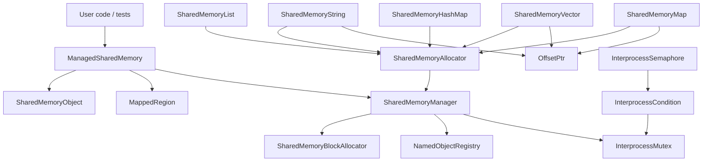

核心分层如下：

| 层级 | 主要文件 | 职责 |
| --- | --- | --- |
| IPC 封装 | `interprocess/ipc/*.h` | 封装 `shm_open`、`ftruncate`、`mmap`、`munmap`、打开模式 |
| 段管理 | `interprocess/allocator/shared_memory_manager.h` | 初始化、attach、命名对象、元数据锁、读写一致性 |
| 分配器 | `interprocess/allocator/detail/shared_memory_block_allocator.h` | 在共享内存段内部分配和释放字节块 |
| STL allocator 适配 | `interprocess/allocator/shared_memory_allocator.h` | 给容器提供 `allocate` / `deallocate` / `construct` |
| 指针模型 | `interprocess/allocator/offset_ptr.h` | 用相对偏移表示共享内存内的指针 |
| 容器 | `interprocess/container/*.h` | shared-memory-aware string/vector/map |
| 同步 | `interprocess/sync/*.h` | 跨进程 mutex、condition、semaphore |
| 测试和样例 | `test/*.cpp` | 生命周期、崩溃恢复、只读快照、并发、benchmark |

## 4. 推荐学习路线

如果你是第一次看这个工程，建议按这个顺序读：

1. `test/shm_open_or_create.cpp`
   了解最小的创建、打开、命名对象使用方式。

2. `interprocess/ipc/managed_shared_memory.h`
   看用户入口类如何组合 POSIX shm、mmap 和 manager。

3. `interprocess/allocator/shared_memory_manager.h`
   看命名对象和段内元数据如何管理。

4. `interprocess/allocator/offset_ptr.h`
   理解为什么共享内存内不能直接保存裸指针。

5. `interprocess/allocator/detail/shared_memory_block_allocator.h`
   看段内分配器如何维护 free list。

6. `interprocess/container/shared_memory_string.h` 和 `shared_memory_vector.h`
   看容器如何使用 allocator 和 `OffsetPtr`。

7. `test/shm_manager_lifecycle.cpp`
   这是最综合的生命周期测试，可以当作行为规格读。

8. `test/shm_read_only_snapshot.cpp`、`test/shm_crash_recovery_complex.cpp`
   分别理解只读快照和崩溃恢复。

## 5. 共享内存段内布局

一段共享内存大致长这样：

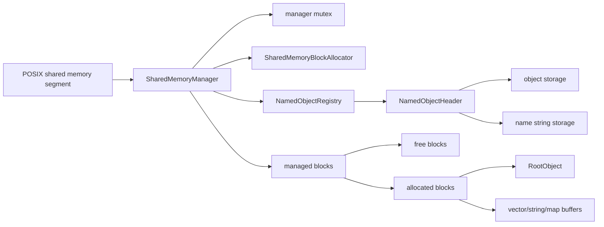

`SharedMemoryManager` 放在共享内存段开头。它内部包含：

- 初始化状态和 magic，用于判断段是否可 attach。
- manager mutex，用于保护元数据修改。
- block allocator，用于管理剩余共享内存。
- named object registry，用于按名字查找对象。
- metadata generation，用于只读 attach 和只读查询的一致性检测。

段内对象、名字字符串、容器 buffer、map 节点都通过 `SharedMemoryBlockAllocator` 从同一段内存里分配。

## 6. 创建和打开流程

### create_only

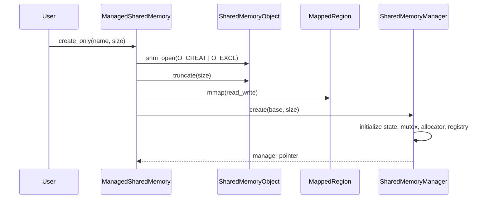

关键点：

- 新段创建后会先 `memset` 为 0。
- manager 使用初始化状态机避免其他进程 attach 到半初始化段。
- 初始化完成后状态变为 `initialized`。

### open_only

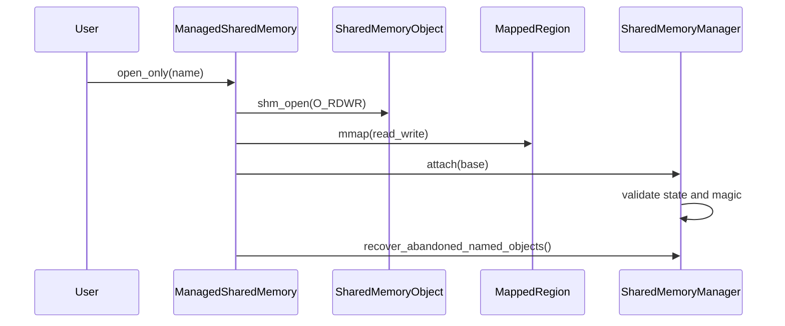

关键点：

- `open_only` 是可写映射。
- attach 成功后会尝试清理死进程留下的 constructing/destroying 命名对象。
- 如果 magic 不匹配，说明共享内存布局版本不兼容，会拒绝 attach。

### open_read_only

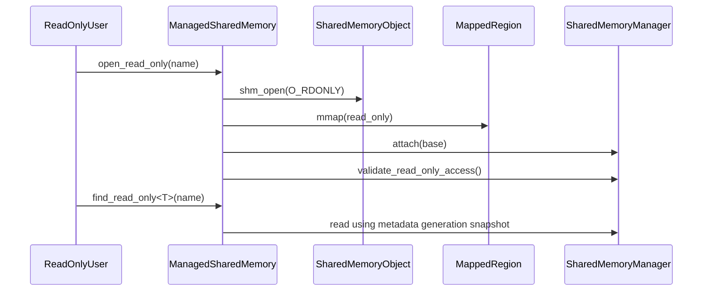

只读映射不能调用会写共享内存的 API，例如 `construct`、`destroy`、`get_allocator`、可写 `find`。这些调用会抛异常。

## 7. 命名对象设计

命名对象是使用者最常接触的能力：

```cpp
auto* value = segment.construct<int>("Answer", 42);
auto* found = segment.find<int>("Answer");
segment.destroy<int>("Answer");
```

内部流程如下：

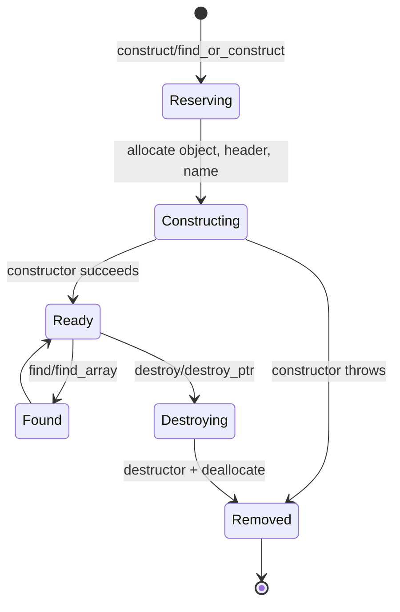

`NamedObjectHeader` 记录：

- 对象地址。
- 名字地址和名字长度。
- 数组元素数量。
- 单个对象大小。
- 类型指纹。
- 名字 hash。
- owner pid。
- 状态：constructing、ready、destroying。

### 类型校验

当前实现会在命名对象头里记录对象大小和类型指纹。下面这些 API 会校验模板参数 `T` 是否和创建时一致：

- `find<T>`
- `find_array<T>`
- `find_or_construct<T>`
- `find_read_only<T>`
- `find_array_read_only<T>`
- `destroy<T>`
- `destroy_ptr<T>`

如果类型不一致，会抛出 `std::runtime_error`，并保持原对象不被错误销毁。

### 为什么构造时有中间状态

构造 C++ 对象可能抛异常，也可能进程崩溃。如果直接把对象发布为 ready，其他进程可能看到半构造对象。

因此构造流程是：

1. 分配 object/header/name storage。
2. registry 中插入 `constructing` 条目。
3. placement new 构造对象。
4. 构造成功后标记为 `ready`。
5. 构造失败时释放所有已分配资源。

这样 `find<T>` 只会看见 `ready` 对象。

## 8. 段内分配器设计

`SharedMemoryBlockAllocator` 是一个轻量级段内 allocator。它不调用系统 `malloc`，而是在共享内存段内部切分 block。

基本结构：

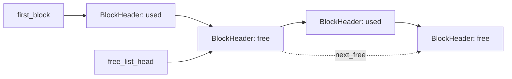

每个 block 有一个 `BlockHeader`：

- `size`：整个 block 大小。
- `is_free`：是否空闲。
- `next_free`：空闲链表中的下一个空闲块。

分配流程：

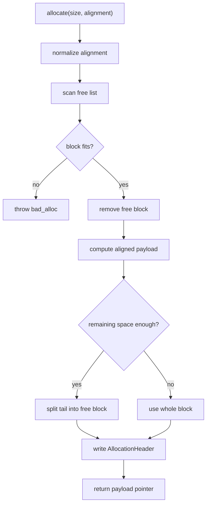

释放流程：

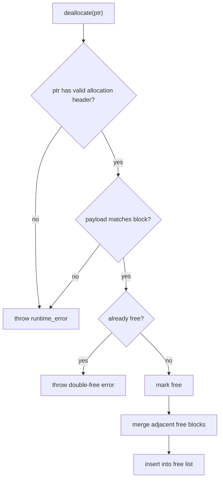

当前 allocator 主要优化点：

- 支持 alignment。
- 支持 split 和 merge。
- 支持 `allocate_many` / `deallocate_many`。
- 支持 `try_expand`，让 vector/string 在相邻空间可用时原地扩容。
- 支持 `check_sanity`、非法指针检测、double-free 检测。

它还不是 Boost.Interprocess 那种完整 `rbtree_best_fit`，但对当前工程的测试和场景已经足够轻量。

## 9. OffsetPtr 设计

`OffsetPtr<T>` 是共享内存对象能跨进程工作的关键。

普通指针保存绝对地址：

```text
process A: object at 0x1000
process B: same mapping may be at 0x7000
```

如果共享对象内部保存 `0x1000`，进程 B 解引用就错了。

`OffsetPtr<T>` 保存的是：

```text
target_address - this_pointer_address
```

只要共享内存内部对象之间的相对位置不变，不同进程都能用自己的映射基址计算出正确地址。

当前实现还做了这些稳健性处理：

- `nullptr` 使用内部 sentinel 表示。
- 设置指针时检查 sentinel 冲突。
- 检查偏移是否能被 `int64_t` 表示。
- 支持从 `OffsetPtr<T>` 转到 `OffsetPtr<const T>`，拒绝反向转换。
- 提供基础 `pointer_traits` 所需的 `element_type` 和 `rebind`。

## 10. SharedMemoryAllocator 设计

`SharedMemoryAllocator<T>` 是 STL allocator 风格的适配层。它持有一个 `SharedMemoryManager*`，所有分配最终转给 manager：

```text
SharedMemoryVector<T>
  -> SharedMemoryAllocator<T>
    -> SharedMemoryManager::allocate
      -> SharedMemoryBlockAllocator::allocate
```

这样容器内部 buffer 会落在共享内存段里，而不是进程私有堆里。

使用示例：

```cpp
using IntVector = interprocess::SharedMemoryVector<int>;

ManagedSharedMemory segment(create_only, "demo", 64 * 1024);
auto allocator = segment.get_allocator<int>();
auto* values = segment.construct<IntVector>("Values", allocator);

values->push_back(1);
values->push_back(2);
```

## 11. 容器设计

### SharedMemoryString

`SharedMemoryString` 类似简化版 `std::string`：

- 内部保存 `start`、`finish`、`end_of_storage` 三个 `OffsetPtr`。
- 字符 buffer 从 `SharedMemoryAllocator<char>` 分配。
- 保证尾部有 `'\0'`，支持 `c_str()`。
- 扩容时优先尝试 allocator 的 `try_expand`。

### SharedMemoryVector

`SharedMemoryVector<T>` 类似简化版 `std::vector<T>`：

- 内部也是 `start`、`finish`、`end_of_storage`。
- 支持 `reserve`、`push_back`、`emplace_back`、`pop_back`、`erase`。
- 扩容时如果相邻空间可用，可以原地扩容，减少 copy/move。

### SharedMemoryList

`SharedMemoryList<T>` 类似简化版 `std::list<T>`：

- 双向链表节点和元素值都放在共享内存段内。
- 节点之间的前驱/后继链接都通过 `OffsetPtr` 保存，跨进程重新映射后仍然有效。
- 支持 `insert`、`erase`、`splice`、`merge`、`sort`、`unique`、`reverse` 等链表常见操作。
- 适合频繁中间插入、节点搬移以及需要稳定迭代器语义的场景。

### SharedMemoryHashMap

`SharedMemoryHashMap<K,V>` 类似简化版 `std::unordered_map<K,V>`：

- bucket 数组和节点都由共享内存 allocator 分配。
- 节点内部同时保存 bucket 冲突链和全表迭代链，二者都用 `OffsetPtr` 连接。
- 支持 `try_emplace`、`insert_or_assign`、`reserve`、`rehash`、`load_factor` 和 bucket 局部迭代。
- 适合跨进程共享 key/value 索引，同时保持比有序 map 更接近哈希表的查找语义。

### SharedMemoryMap

`SharedMemoryMap<K,V>` 基于段内红黑树实现：

- 节点通过共享内存 allocator 分配。
- 指向子节点、父节点的链接使用 `OffsetPtr`。
- 有 node cache，用于降低 erase 后再次 insert 的分配次数。
- `shrink_to_fit` 可以释放缓存节点。

## 12. 同步设计

跨进程共享对象本身不自动加业务锁。调用方需要把锁也放进共享内存对象里：

```cpp
struct RootObject
{
    interprocess::InterprocessMutex mutex;
    interprocess::SharedMemoryString message;

    explicit RootObject(const interprocess::SharedMemoryAllocator<char>& alloc)
        : message(alloc)
    {
    }
};
```

读写流程：

```cpp
root->mutex.lock();
root->message = "hello";
root->mutex.unlock();
```

`InterprocessMutex` 基于 `pthread_mutex_t`：

- 设置 `PTHREAD_PROCESS_SHARED`，支持跨进程。
- Linux 支持时启用 robust mutex。
- owner-dead 时可返回 recovery 状态。

manager 内部也有一个 mutex，用于保护 allocator 和 registry 元数据。业务对象内容是否同步，仍由调用方负责。

## 13. 崩溃恢复设计

工程里有两类恢复：

### manager 元数据锁恢复

如果进程持有 manager mutex 时崩溃，其他进程再次 lock 时可能收到 owner-dead 状态。

处理流程：

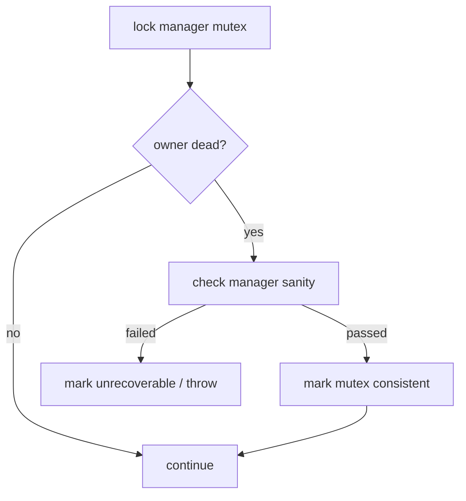

### abandoned named object 清理

构造对象时会记录 owner pid。如果进程死在 constructing/destroying 状态，后续 `open_only` 会调用 `recover_abandoned_named_objects()` 清理这些条目，释放对应内存。

注意：这只能恢复 manager 能识别的元数据状态。业务对象自己的语义恢复，需要业务层设计版本号、事务标记或校验字段。

## 14. 只读快照设计

只读映射不能锁 manager mutex，因为 robust mutex lock/unlock 会写共享内存。为避免只读进程读取到正在变化的 manager 元数据，manager 使用 `metadata_generation` 做轻量一致性检测。

写路径：


只读路径：

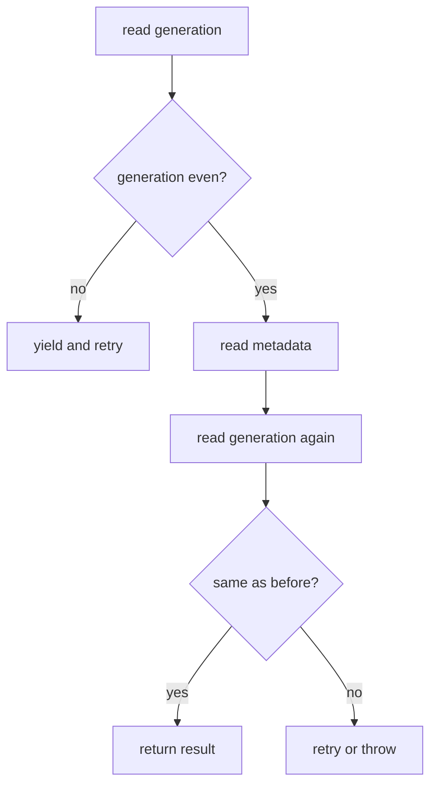

这能保护 manager 元数据读取的一致性，例如 named object registry、free memory 统计等。

限制：

- 它不保护业务对象内容，例如 vector 正在被另一个进程修改。
- 业务对象内容仍需要业务锁、版本号或外部协议保证一致。

## 15. Segment grow / shrink

工程支持静态维护操作：

```cpp
ManagedSharedMemory::grow("demo", 64 * 1024);
ManagedSharedMemory::shrink_to_fit("demo");
```

设计原则：

- 这是维护操作，不应和其他进程并发访问同一段共享内存。
- grow 会先调整 POSIX shm 文件大小，再让 block allocator 接管新增空间。
- shrink 会先计算尾部可裁剪空间，再尝试缩小 POSIX shm。
- 如果平台不支持二次 `ftruncate`，接口返回 `false` 或回滚元数据。

macOS 上 POSIX shm 二次调整大小可能受限，所以测试覆盖了失败不破坏状态的路径。

## 16. 测试如何对应设计

| 测试 | 覆盖重点 |
| --- | --- |
| `shm_open_or_create` | 创建、打开、重复打开语义 |
| `shm_manager_lifecycle` | 命名对象、数组、异常回滚、类型校验、只读访问、grow/shrink |
| `shm_allocator_fragmentation` | allocator 碎片、批量分配、原地扩容、sanity |
| `shm_concurrent_process_stress` | 多进程共享容器和业务锁 |
| `shm_crash_recovery_complex` | robust mutex owner-dead 和业务恢复 |
| `shm_read_only_snapshot` | 只读映射、只读 API、类型校验 |
| `shm_mutex_robust` | robust mutex 行为 |
| `shm_semaphore` | semaphore 和 condition 基础同步 |
| `shm_string_producer_consumer` | string producer/consumer 集成流程 |
| `shm_nested_producer_consumer` | 嵌套容器 producer/consumer 集成流程 |
| `shm_map_producer_consumer` | map producer/consumer 集成流程 |
| `shm_vector_producer_consumer` | 带业务锁的 vector producer/consumer 集成流程 |

`shm_benchmark` 会被构建成可执行程序，但不注册为 CTest。它用于 allocator、`allocate_many`、map insert/find/erase 的性能趋势观察，不作为稳定性能基准。

运行全部 CTest：

```sh
cmake -S . -B build -DCMAKE_BUILD_TYPE=Release
cmake --build build -j 8
ctest --test-dir build --output-on-failure
```

`CMAKE_BUILD_TYPE` 支持 `Release` 和 `Debug`，未指定时默认为 `Release`。如果要跑 Debug 构建：

```sh
cmake -S . -B build-debug -DCMAKE_BUILD_TYPE=Debug
cmake --build build-debug -j 8
ctest --test-dir build-debug --output-on-failure
```

只运行复杂场景：

```sh
ctest --test-dir build -L complex --output-on-failure
```

只运行 producer/consumer 集成场景：

```sh
ctest --test-dir build -L producer --output-on-failure
```

producer/consumer CTest 由 `cmake/run_producer_consumer_pair.sh` 组织。脚本会先启动 producer，等待 ready 日志，再启动 consumer；需要回车退出的 producer 会通过 FIFO 自动接收换行并清理共享内存。

## 17. 常见使用模式

### 单根对象模式

推荐把复杂共享状态挂在一个 root object 下面：

```cpp
struct RootObject
{
    interprocess::InterprocessMutex mutex;
    interprocess::SharedMemoryString name;
    interprocess::SharedMemoryVector<int> values;

    RootObject(const interprocess::SharedMemoryAllocator<char>& char_alloc,
               const interprocess::SharedMemoryAllocator<int>& int_alloc)
        : name(char_alloc), values(int_alloc)
    {
    }
};
```

创建：

```cpp
interprocess::ManagedSharedMemory segment(interprocess::create_only, "demo", 128 * 1024);
auto* root = segment.construct<RootObject>(
    "RootObject", segment.get_allocator<char>(), segment.get_allocator<int>());
```

打开：

```cpp
interprocess::ManagedSharedMemory segment(interprocess::open_only, "demo");
auto* root = segment.find<RootObject>("RootObject");
```

### producer / consumer 模式

producer 创建段和 root object，consumer 使用 `open_only` 打开段并按名字查找 root object。业务数据读写用 root object 内部的 mutex 保护。

### read-only snapshot 模式

只读进程使用 `open_read_only` 和 `find_read_only<T>`。它适合查看稳定状态，或者由业务协议保证 writer 暂停修改的场景。

## 18. 使用约束

使用本工程时需要记住这些规则：

- 放进共享内存的对象不能保存进程私有资源指针。
- 容器成员要使用 shared-memory-aware 容器，而不是普通 `std::string` / `std::vector`。
- 命名对象的 `find<T>` / `destroy<T>` 类型必须和创建时一致。
- 多进程并发修改业务对象时必须加业务锁。
- 只读 API 只能保证 manager 元数据快照一致，不能自动保证业务对象内容一致。
- segment grow/shrink 是维护操作，不要和其他进程并发访问。
- shared memory 名称受平台限制，测试里使用短名称规避 `ENAMETOOLONG`。

## 19. 和 Boost.Interprocess 的关系

本项目借鉴 Boost.Interprocess 的方向：

- managed segment 作为入口。
- offset pointer 支持不同映射基址。
- 段内 allocator。
- shared-memory-aware containers。
- named object registry。
- process-shared synchronization。

但本项目没有完整复刻 Boost：

- allocator 仍是轻量 free-list 设计，不是完整树形 best-fit。
- named object index reserve 当前偏接口和统计语义。
- 只读快照保护 manager 元数据，不覆盖所有业务对象内容。
- 类型指纹使用编译器函数签名 hash，更适合同构构建环境，跨编译器/跨版本 ABI 仍需更稳定策略。

## 20. 快速定位问题

如果遇到问题，可以按现象定位：

| 现象 | 优先看哪里 |
| --- | --- |
| `construct` 返回 nullptr | 是否同名对象已存在或正在 constructing |
| `find<T>` 抛类型不匹配 | 创建时类型和查找模板参数是否一致 |
| `bad_alloc` | 共享内存段大小是否不足，是否碎片化严重 |
| double free / invalid pointer | 是否释放了非段内指针或重复释放 |
| 只读 API 抛 metadata changed | 是否有 writer 正在修改 manager 元数据 |
| 多进程数据错乱 | 业务对象是否缺少 `InterprocessMutex` 保护 |
| attach 失败 magic mismatch | 段布局版本不兼容，需要重建共享内存段 |
| owner-dead 异常 | 持锁进程崩溃，需要业务层恢复状态后 mark consistent |

## 21. 下一步可以继续增强的方向

适合理解工程后继续推进的方向：

- allocator 引入边界标签、末尾哨兵、树形空闲索引。
- named object reserve 做成真实预分配索引资源。
- 提供 `atomic_func`，支持多对象原子发布。
- 类型标识改为用户可控的稳定 type id。
- 容器补齐更多 STL 接口。
- 为 read-only 业务对象增加版本化读协议示例。
- 为 benchmark 增加固定数据规模和历史结果记录。
